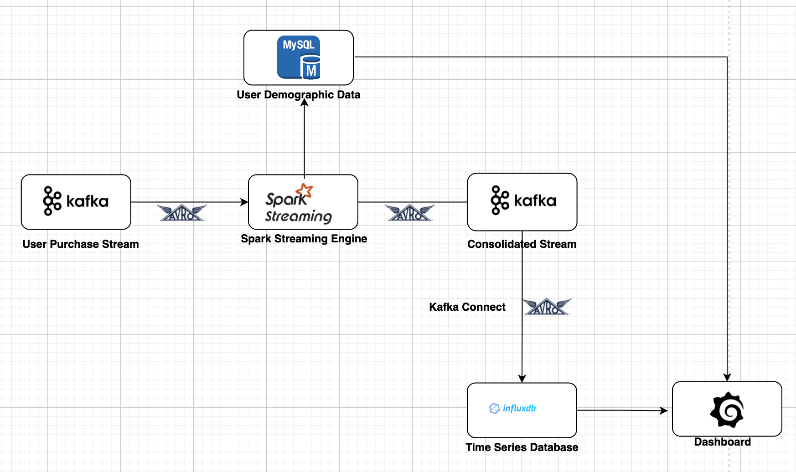

### ⚡ Real-Time Analytics Dashboard with Kafka, Spark Streaming, InfluxDB & Grafana

This project is inspired by a solution published on [ProjectPro.io](https://www.projectpro.io), and was developed independently from scratch through continuous research, experimentation, and improvement—from a simple proof of concept to a production-ready setup.

## 📌 Overview
This project demonstrates how to build a real-time analytics system using cutting-edge big data tools. It ingests user events (e.g., clicks, purchases), enriches them with demographic data, processes the stream in near real-time, stores them in a time-series database, and visualizes meaningful KPIs on Grafana dashboards.

## 🔥 Core Use Case
- Goal: Monitor real-time performance of an e-commerce platform by aggregating and visualizing user interactions and purchases.
- Metrics include:
    + Campaign performance by country
    + Order trends by gender
    + Real-time purchase insights

## 📦 Dataset
🔁 Batch Data (Demographics)
    - ~100,000 synthetic user records
    - Features: Id, Age, Gender, State, Country

🔁 Stream Data (Events every second)
    - Simulated in real-time
    - Features: Id, CampaignID, OrderID, Total_Amount, Units, Tags (click/purchase), Timestamp

## 🔧 Technologies Used
| Technology              | Description                                                                 |
|-------------------------|-----------------------------------------------------------------------------|
| **Docker & Docker Compose** | Containerization and orchestration of all services                         |
| **Apache Kafka**         | Real-time data streaming and messaging system                               |
| **Apache Spark (Structured Streaming)** | Real-time data processing and stream analytics                          |
| **InfluxDB**             | Time-series database for storing metrics and events                         |
| **Grafana**              | Dashboard and visualization tool connected to InfluxDB                      |
| **Python / Scala**       | Used for implementing data pipeline logic (depending on your use case)       |
| **Kafka Connect** *(optional)* | Connects Kafka to external systems like InfluxDB                          |

## 🧩 Key Features
- Real-time streaming analytics
- Low latency Spark Streaming jobs
- Kafka–Spark–InfluxDB integration
- Interactive Grafana dashboards
- Dockerized setup with docker-compose
- Structured logging and monitoring

## 📊 Visualization
Once the pipeline is running, real-time data can be visualized through Grafana dashboards connected to InfluxDB.

## 📚 Learning Outcomes
Through this project, one can:
- Grasp the architectural design of real-time data pipelines
- Implement Kafka-based messaging systems
- Develop real-time analytics with Apache Spark Streaming
- Store and query time-series data using InfluxDB
- Build monitoring dashboards with Grafana
- Deploy microservices-based architecture using Docker

## 🌱 Potential Enhancements
- Integration with Confluent Schema Registry for Avro schema enforcement
- Deployment of Kafka Connect UI for easier management
- Auto-scaling of Spark jobs based on stream volume
- Incorporation of machine learning models for trend prediction
- Migration to a cloud-native infrastructure (e.g., Kubernetes)

## ✍️ Acknowledgments
This project was implemented with a strong emphasis on self-learning and open-source best practices. All architectural decisions and configurations were developed through rigorous testing, validation, and refinement.

## 📄 License
This project is for educational and research purposes. Attribution is given to ProjectPro for the initial idea.

"# DE-Build-a-Real-time-dashboard" 
